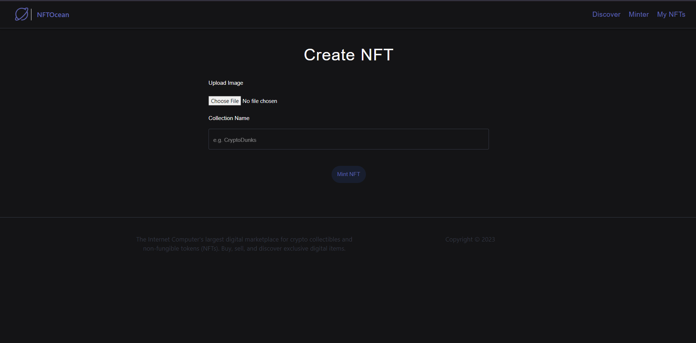
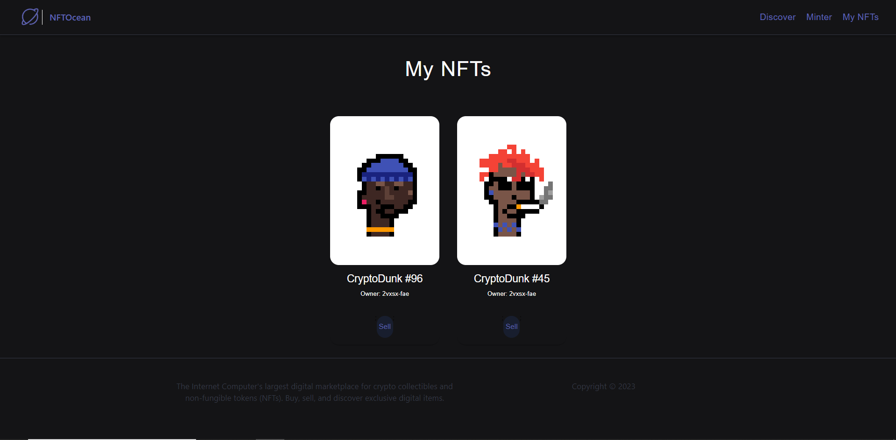
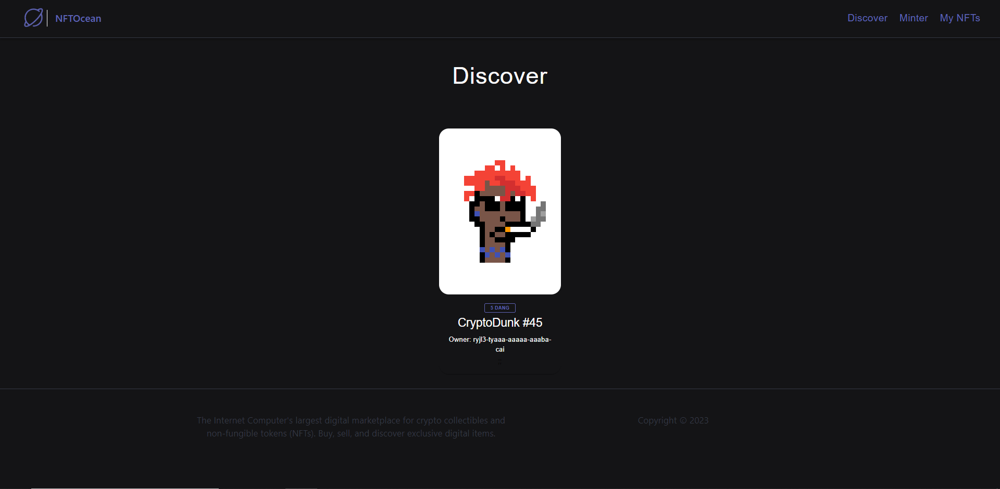

Welcome to `NFTOcean`, your gateway to minting, buying, and selling your very own CryptoDunks! This fully workable project is an exciting venture that I've poured my heart into.

Undoubtedly, this has been one of my most challenging projects to date, but it has been incredibly rewarding. Along the way, I encountered numerous errors that served as valuable learning opportunities, allowing me to grasp essential concepts in React and Motoko.

For the frontend development, I utilized the power of `React Js`, while the backend is driven by the robust `Motoko language`. Additionally, this project is intricately linked to my `Crypto Token Project`, as NFT transactions require tokens for seamless buying and selling.

While I haven't deployed the project to a live server due to significant costs involved in deploying, minting, and selling NFTs, I've created a local version to showcase its capabilities.

If you're eager to dive into this project, make sure to visit the `Dfinity Site`. There, you can download and explore the concepts I've implemented to bring this exciting venture to life.

I hope you enjoy your time on `NFTOcean`, and feel free to reach out if you have any questions or interest in collaborating on this remarkable project!

# Glimpse of my Project

- **Home Page** : Attractive Home Page For my NFTOcean


- **Minter**: This where One can Mint their CryptoDunks


This is how it appears after minting your NFT.


- **MY NFTs**: Here All your NFTs that are unsold and bought ones will appear.Here you can Sell your NFTs and then they will appear in Discover.


- **Discover**: All the NFTs that are not yours or sold will appear here.Here I have sold this NFT for `5 DANG` (Now What is DANG it is my own Crypto Token Made in my Crypto Token Project)



# To Install and Run the Project

1. start local dfx

```
dfx start --clean
```

2. Run NPM server

```
npm start
```

3. Deploy canisters

```
dfx deploy --argument='("CryptoDunks #123", principal "fbhkd-lllmt-tguhe-khq3h-krbxn-qgked-5jbik-2pqdz-iys6c-4gyjx-vqe", (vec {137; 80; 78; 71; 13; 10; 26; 10; 0; 0; 0; 13; 73; 72; 68; 82; 0; 0; 0; 10; 0; 0; 0; 10; 8; 6; 0; 0; 0; 141; 50; 207; 189; 0; 0; 0; 1; 115; 82; 71; 66; 0; 174; 206; 28; 233; 0; 0; 0; 68; 101; 88; 73; 102; 77; 77; 0; 42; 0; 0; 0; 8; 0; 1; 135; 105; 0; 4; 0; 0; 0; 1; 0; 0; 0; 26; 0; 0; 0; 0; 0; 3; 160; 1; 0; 3; 0; 0; 0; 1; 0; 1; 0; 0; 160; 2; 0; 4; 0; 0; 0; 1; 0; 0; 0; 10; 160; 3; 0; 4; 0; 0; 0; 1; 0; 0; 0; 10; 0; 0; 0; 0; 59; 120; 184; 245; 0; 0; 0; 113; 73; 68; 65; 84; 24; 25; 133; 143; 203; 13; 128; 48; 12; 67; 147; 94; 97; 30; 24; 0; 198; 134; 1; 96; 30; 56; 151; 56; 212; 85; 68; 17; 88; 106; 243; 241; 235; 39; 42; 183; 114; 137; 12; 106; 73; 236; 105; 98; 227; 152; 6; 193; 42; 114; 40; 214; 126; 50; 52; 8; 74; 183; 108; 158; 159; 243; 40; 253; 186; 75; 122; 131; 64; 0; 160; 192; 168; 109; 241; 47; 244; 154; 152; 112; 237; 159; 252; 105; 64; 95; 48; 61; 12; 3; 61; 167; 244; 38; 33; 43; 148; 96; 3; 71; 8; 102; 4; 43; 140; 164; 168; 250; 23; 219; 242; 38; 84; 91; 18; 112; 63; 0; 0; 0; 0; 73; 69; 78; 68; 174; 66; 96; 130;}))'
```

4. Head to localhost
```
http://localhost:8080/
```

# Creating NFT for Testing

1. Mint an NFT on the command line to get NFT into mapOfNFTs:

```
dfx canister call opend mint '(vec {137; 80; 78; 71; 13; 10; 26; 10; 0; 0; 0; 13; 73; 72; 68; 82; 0; 0; 0; 10; 0; 0; 0; 10; 8; 6; 0; 0; 0; 141; 50; 207; 189; 0; 0; 0; 1; 115; 82; 71; 66; 0; 174; 206; 28; 233; 0; 0; 0; 68; 101; 88; 73; 102; 77; 77; 0; 42; 0; 0; 0; 8; 0; 1; 135; 105; 0; 4; 0; 0; 0; 1; 0; 0; 0; 26; 0; 0; 0; 0; 0; 3; 160; 1; 0; 3; 0; 0; 0; 1; 0; 1; 0; 0; 160; 2; 0; 4; 0; 0; 0; 1; 0; 0; 0; 10; 160; 3; 0; 4; 0; 0; 0; 1; 0; 0; 0; 10; 0; 0; 0; 0; 59; 120; 184; 245; 0; 0; 0; 113; 73; 68; 65; 84; 24; 25; 133; 143; 203; 13; 128; 48; 12; 67; 147; 94; 97; 30; 24; 0; 198; 134; 1; 96; 30; 56; 151; 56; 212; 85; 68; 17; 88; 106; 243; 241; 235; 39; 42; 183; 114; 137; 12; 106; 73; 236; 105; 98; 227; 152; 6; 193; 42; 114; 40; 214; 126; 50; 52; 8; 74; 183; 108; 158; 159; 243; 40; 253; 186; 75; 122; 131; 64; 0; 160; 192; 168; 109; 241; 47; 244; 154; 152; 112; 237; 159; 252; 105; 64; 95; 48; 61; 12; 3; 61; 167; 244; 38; 33; 43; 148; 96; 3; 71; 8; 102; 4; 43; 140; 164; 168; 250; 23; 219; 242; 38; 84; 91; 18; 112; 63; 0; 0; 0; 0; 73; 69; 78; 68; 174; 66; 96; 130;}, "CryptoDunks #123")'
```

2. List the item into mapOfListings:

```
dfx canister call opend listItem '(principal "qvhpv-4qaaa-aaaaa-aaagq-cai", 2)'
```

3. Get OpenD canister ID:

```
dfx canister id opend
```

4. Transfer NFT to OpenD:

```
dfx canister call qvhpv-4qaaa-aaaaa-aaagq-cai transferOwnership '(principal "ryjl3-tyaaa-aaaaa-aaaba-cai", true)'
```

# Conneting to the Token Canister

1. Copy over the token declarations folder

2. Set the token canister id into the <REPLACE WITH TOKEN CANISTER ID>

```
const dangPrincipal = Principal.fromText("<REPLACE WITH TOKEN CANISTER ID>");
```

**All the CryptoDunks which are show in the pictures are made by me on a website.**# NFT-website
